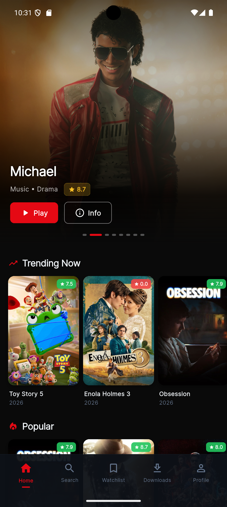
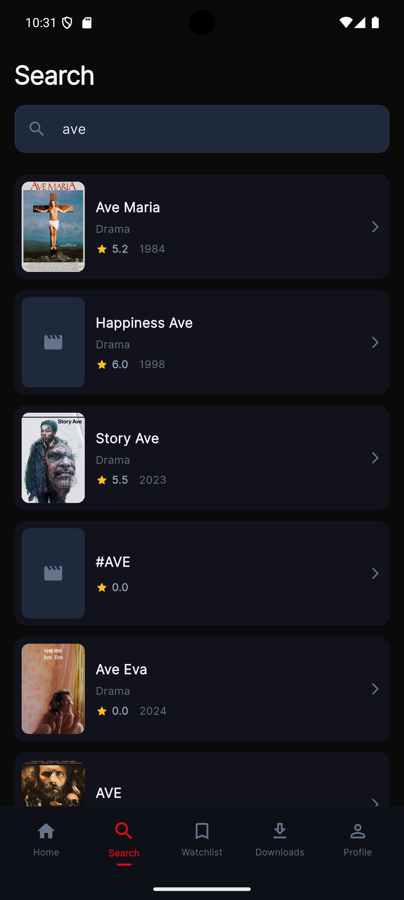
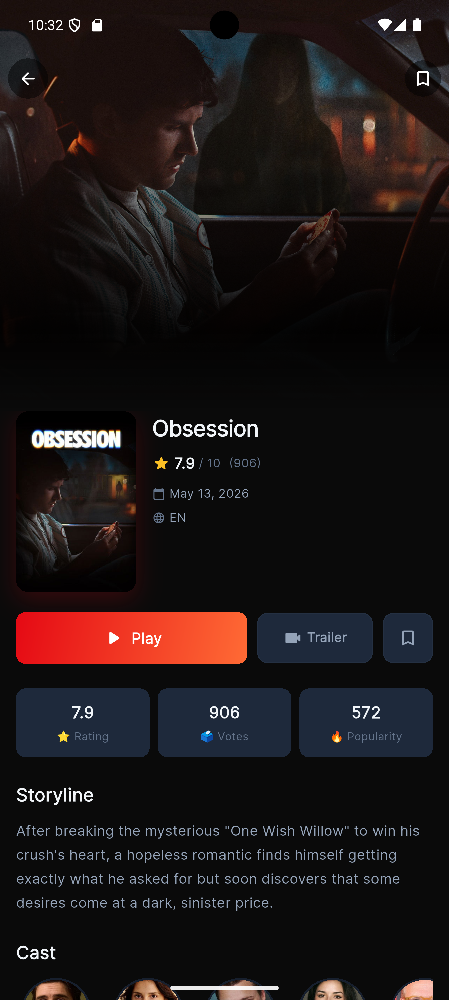

# Flixora 🎬

A Flutter movie application built using **BLoC State Management**, **TMDB API**, and **SQFlite** for offline caching. The application allows users to browse trending movies, search for movies, view detailed information, and access cached data when offline.

---

## Features

* View trending movies from TMDB
* Movie detail screen with complete information
* Infinite scroll pagination
* Movie search functionality
* Offline support using SQFlite caching
* BLoC state management
* Named route navigation
* Dark theme UI
* Pull-to-refresh
* Cached network images
* Error handling and loading states

---

## Tech Stack

* Flutter
* flutter_bloc
* Equatable
* HTTP
* SQFlite
* Cached Network Image
* Shimmer
* TMDB API

---

## Architecture

The application follows a layered architecture:

UI
↓
BLoC
↓
Repository
↓
API / Database

### Main Components

* UI Layer – Screens and reusable widgets
* BLoC Layer – State management and business logic
* Repository Layer – Single source of data handling
* API Layer – TMDB network communication
* Database Layer – SQFlite offline caching

---

## Project Structure

lib/
├── core/
│   ├── constants/
│   ├── routes/
│   └── utils/
│
├── data/
│   ├── database/
│   ├── models/
│   └── services/
│
├── logic/
│   ├── bloc/
│   └── cubit/
│
├── ui/
│   ├── screens/
│   └── widgets/
│
└── main.dart

---

## API

This project uses The Movie Database (TMDB) API.

Movie List:
https://api.themoviedb.org/3/trending/movie/day

Movie Detail:
https://api.themoviedb.org/3/movie/{movie_id}

Search Movies:
https://api.themoviedb.org/3/search/movie

Image Base URL:
https://image.tmdb.org/t/p/w500

---

## Getting Started

### Clone Repository

git clone https://github.com/nishmajabin/flixora

cd flixora

### Install Dependencies

flutter pub get

### Run Application

flutter run

---

## Offline Support

Movies fetched from the API are cached locally using SQFlite. If the device loses internet connectivity, the application automatically loads previously cached movie data.

---

## Pagination

The application implements infinite scrolling pagination using flutter_bloc. Additional movie pages are automatically fetched when the user scrolls near the end of the list.

---

## Screenshots

### Home Screen

### Search Screen

### Detail Screen

---

## Future Improvements

* Favorites / Watchlist synchronization
* Trailer support
* Movie recommendations
* Advanced filtering
* User authentication

---

## Author

Developed by Nishma Jabin
